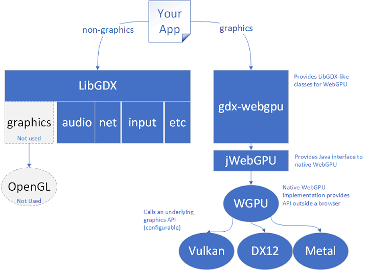

# gdx-webgpu
by Monstrous Software


[](https://central.sonatype.com/artifact/io.github.monstroussoftware.gdx-webgpu/gdx-webgpu)
[](https://central.sonatype.com/service/rest/repository/browse/maven-snapshots/io/github/monstroussoftware/gdx-webgpu/)

## What is it?
This is an extension for LibGDX which allows you to use the WebGPU graphics API instead of OpenGL.

WebGPU is a modern graphics API that was developed for browsers, but can also be used for native applications.
So it is not just for web, but also for desktop and mobile applications.
WebGPU can make use of different backends, such as Vulkan, Metal or DirectX.

## How does it work?
The gdx-webgpu extension provides a number of graphics classes (WgSpriteBatch, WgModelBatch, WgStage, etc.) to use instead of the ones from LibGDX.  These provide the same behaviour without using OpenGL.

The gdx-webgpu extension uses [jWebGPU](https://github.com/xpenatan/jWebGPU) by Xpenatan as underlying API which provides a multi-platform Java interface to a native WebGPU implementation, in particular to WGPU. 

  

## How to use it?
Instead of the regular application launcher, use the gdx-webgpu launcher for your platform as described below. 

Then in your application, you can generally code as normal for LibGDX applications, except that for some graphics classes you need to use an alternative class.
Gdx-webgpu provides substitute classes for many of the LibGDX graphics classes.  
For example, instead of `Texture`, you would use `WgTexture`, instead of `SpriteBatch` you would use `WgSpriteBatch`, etcetera. It's not possible to mix and match;
there is no OpenGL context so using any classes that rely on OpenGL will result in error messages.


Here is an example that should look very familiar to LibGDX users:
```java
package main.java;

import com.badlogic.gdx.ApplicationAdapter;
import com.badlogic.gdx.Gdx;
import com.badlogic.gdx.graphics.Texture;
import com.monstrous.gdx.webgpu.backends.desktop.WgDesktopApplication;
import com.monstrous.gdx.webgpu.graphics.WgTexture;
import com.monstrous.gdx.webgpu.graphics.g2d.WgSpriteBatch;

public class HelloTexture extends ApplicationAdapter {

    private Texture texture;
    private SpriteBatch batch;

    @Override
    public void create() {
        texture = new WgTexture(Gdx.files.internal("data/badlogic.jpg")); // note: WgTexture
        batch = new WgSpriteBatch();                                      // note: WgSpriteBatch
    }

    @Override
    public void render() {
        batch.begin();
        batch.draw(texture, 0, 0);
        batch.end();
    }

    @Override
    public void dispose(){
        batch.dispose();
        texture.dispose();
    }
}
```
Note in the example that `WgTexture` was used to create the `Texture` object.  `WgTexture` is a subclass of `Texture`, suitable for WebGPU.  Also note that `WgSpriteBatch` was used instead of `SpriteBatch`.  In this example, these are the only two changes from a regular LibGDX application: using types with a Wg- prefix instead of the standard LibGDX graphics classes. 


For more information see the [User Guide](docs/user_guide.md) in the `docs` folder

## Launcher code

To start up a gdx-webgpu application, a platform-specific [starter class](https://libgdx.com/wiki/app/starter-classes-and-configuration) will call the relevant back-end and run the application specific code.

For example to launch a gdx-webgpu application for desktop, create a `WgApplication` and pass it an instance of `ApplicationListener` and optionally a configuration object.

```java
package com.example.mygame;

import com.example.mygame.MyGame;
import com.monstrous.gdx.webgpu.application.WebGPUContext;
import com.monstrous.gdx.webgpu.backends.desktop.WgDesktopApplication;
import com.monstrous.gdx.webgpu.backends.desktop.WgDesktopApplicationConfiguration;

public class Launcher {

    public static void main (String[] argv) {
  		WgApplicationConfiguration config = new WgApplicationConfiguration();
  		config.setWindowedMode(1200, 800);
  		new WgApplication(new MyGame(), config);
  	}
  }
```
## Can I call WebGPU directly?
Yes, you can call WebGPU functions directly through the `jWebGPU` interface. This may be necessary for example when working with compute shaders.

See here for some more information: [intro to WebGPU](docs/intro-to-webgpu.md)

## Can I see a demo?

If you run the `WebGPUTestStarter` application in the tests module, you get a menu with lots of 
different test cases.

You can also check out the web version here: [tests](https://monstrous-software.itch.io/gdx-webgpu-sampler).
(Press Escape to return to the test selection menu).

## New features 

Apart from the graphics platform, gdx-webgpu offers some new features with regard to LibGDX:
- support for 32-bit index values for a mesh allowing for larger meshes.
- automatic instancing of identical modelInstances so that they are rendered in a single draw call.
- built-in support for GLTF and GLB model format.
- debug feature to measure GPU time per render pass.

## Dependencies (software bill of materials)

| gdx-webgpu | libgdx | gdx-teavm  | jWebGPU |
|------------|--------|------------|---------|
| 0.7.2      |1.14.0  | 1.4.0      | 0.1.11  |
| 0.7.1      |1.14.0  | 1.4.0      | 0.1.9   |
| 0.7        |1.14.0  | 1.4.0      | 0.1.9   |
| 0.6        |1.13.5  | 1.3.0      | 0.1.6   |

## How to get it

There are a few configuration steps to use `gdx-webgpu`. This assumes you have created a project with `gdx-liftoff`.
If you are starting a new project, it is also a good idea to start with `gdx-liftoff` to set up a project structure. 

The library is available via Maven Central. Make sure the following section is included under `subprojects` in `build.gradle`:

    repositories {
        maven { url = uri("https://central.sonatype.com/repository/maven-snapshots/") }
    }


Define the version you want to use in the `gradle.properties` file, e.g. 

    gdxWebGPUVersion=0.7.2

You can refer to the latest stable release number, e.g. `0.7.2` or use `-SNAPSHOT` to follow the very latest developments. 
(Beware when using a snapshot version, that functions may break without notice. Use a stable version by preference).

To include the library in your project add the following lines to your `build.gradle` file in the `core` module:

    dependencies {
        
        api "io.github.monstroussoftware.gdx-webgpu:gdx-webgpu:$gdxWebGPUVersion"  
        // comment out the following:
        // api "com.badlogicgames.gdx:gdx:$gdxVersion"
    }


Assuming we want to use the LWJGL3 (=Desktop) platform, add the following to `build.gradle` in the `lwjgl3` module:

    dependencies {
        implementation "io.github.monstroussoftware.gdx-webgpu:backend-desktop:$gdxWebGPUVersion"
        // comment out the following:
        //  implementation "com.badlogicgames.gdx:gdx-backend-lwjgl3:$gdxVersion"
        //  implementation "com.badlogicgames.gdx:gdx-lwjgl3-angle:$gdxVersion"
        //  implementation "com.badlogicgames.gdx:gdx-platform:$gdxVersion:natives-desktop"
    }

In the `lwjgl3` module add a starter class called `Launcher.java` with a content as follows:

Launcher.java:
```java
    package com.monstrous.test.lwjgl3;
    
    import com.monstrous.gdx.webgpu.backends.desktop.WgDesktopApplication;
    import com.monstrous.gdx.webgpu.backends.desktop.WgDesktopApplicationConfiguration;
    import com.monstrous.test.Main;
    
    public class Launcher {
        public static void main (String[] argv) {
    
            WgDesktopApplicationConfiguration config = new WgDesktopApplicationConfiguration();
            config.setWindowedMode(640, 480);
            config.setTitle("WebGPU");
            config.enableGPUtiming = false;
            config.useVsync(true);
            new WgDesktopApplication(new Main(), config);
        }
    }
```

In the `lwjgl3` module find the line in `build.gradle` which defines `mainClassName` and point it to the new starter class (delete the file `Lwjgl3Launcher.java`):

    // old line: 
    //mainClassName = 'com.monstrous.test.lwjgl3.Lwjgl3Launcher'

    // new line:
    mainClassName = 'com.monstrous.test.lwjgl3.Launcher'

Make sure your application uses gdx-webgpu classes where necessary, e.g. WgSpriteBatch instead of SpriteBatch,
WgTexture instead of Texture, WgScreenUtils instead of ScreenUtils, etcetera.


If you want to use the Web TeaVM platform, set the dependencies as follows in `build.gradle` of the `teavm` module:

    dependencies {
        implementation "com.github.xpenatan.gdx-teavm:backend-teavm:$gdxTeaVMVersion"
        implementation "io.github.monstroussoftware.gdx-webgpu:backend-teavm:$gdxWebGPUVersion"
        implementation "io.github.monstroussoftware.gdx-webgpu:backend-teavm:$gdxWebGPUVersion:sources"

        // the following lines can be commented out as gdx-teavm will pull these in anyway:
        //  implementation "org.teavm:teavm-classlib:$teaVMVersion"
        //  implementation "org.teavm:teavm-core:$teaVMVersion"
        //  implementation "org.teavm:teavm-jso-apis:$teaVMVersion"
        //  implementation "org.teavm:teavm-jso-impl:$teaVMVersion"
        //  implementation "org.teavm:teavm-jso:$teaVMVersion"
        //  implementation "org.teavm:teavm-tooling:$teaVMVersion"

        implementation project(':core')
    }

Also here, you will need to modify the launcher class (to be described...). 
Modify the last line which creates a `TeaApplication` to create a `WgTeaApplication` instead: 

```java
    public static void main(String[] args) {
        TeaApplicationConfiguration config = new TeaApplicationConfiguration("canvas");
    
        //...
    
        new WgTeaApplication(new Main(), config);
        //new TeaApplication(new Main(), config);
    }
```


