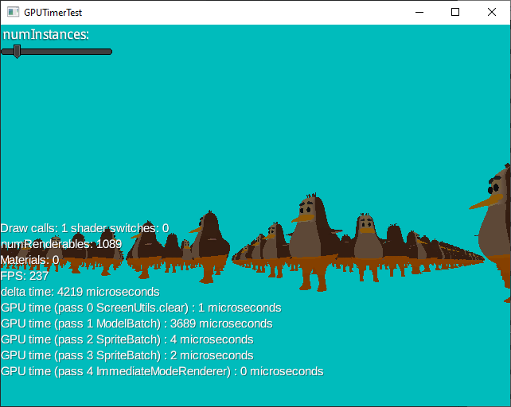

# Gdx-webgpu
by Monstrous Software

## What is it?
This is an extension for LibGDX which allows you to use the WebGPU graphics API instead of OpenGL.

WebGPU is a modern graphics API that was developed for browsers, but can also be used for native applications. 
WebGPU can make use of different backends, such as Vulkan, Metal or DirectX. 

## How to use it?
Instead of the regular application launcher, use the gdx-webgpu launcher for your platform as described below. (At this moment, only Windows desktop is supported).

Then in your application, you can generally code as normal for LibGDX applications, except that for some graphics classes you need to use an alternative class.
Gdx-webgpu provides substitute classes for many of the LibGDX graphics classes.  
For example, instead of `Texture`, you would use `WgTexture`, instead of `SpriteBatch` you would use `WgSpriteBatch`, instead of `Stage` you would use `WgStage`, etcetera.

Here is an example that should look very familiar to LibGDX users:
```java
package main.java;

import com.badlogic.gdx.ApplicationAdapter;
import com.badlogic.gdx.Gdx;
import com.badlogic.gdx.graphics.Texture;
import com.monstrous.gdx.webgpu.backends.desktop.WgDesktopApplication;
import com.monstrous.gdx.webgpu.graphics.WgTexture;
import com.monstrous.gdx.webgpu.graphics.g2d.WgSpriteBatch;

public class HelloTexture extends ApplicationAdapter {

    private Texture texture;
    private WgSpriteBatch batch;

    @Override
    public void create() {
        texture = new WgTexture(Gdx.files.internal("data/badlogic.jpg")); // <--
        batch = new WgSpriteBatch(); // <--
    }

    @Override
    public void render() {
        batch.begin();
        batch.draw(texture, 0, 0);
        batch.end();
    }

    @Override
    public void dispose(){
        batch.dispose();
        texture.dispose();
    }
}
```
Note in the example that WgTexture was used to create the Texture object.  WgTexture is a subclass of Texture, suitable for WebGPU.  Also note that WgSpriteBatch was used instead of SpriteBatch.  In this example, these are the only two changes from a regular LibGDX application: Using types with a Wg- prefix instead of the standard LibGDX graphics classes. 


When using the WebGPU for rendering, the substitute classes need to be used as the original classes will not work without a GL context and this will generally lead to a run-time exception.

Sometimes the substitute class is subclassed from the original class (as in the WgTexture from the example, which is subclassed from Texture).  In these cases you can provide the subclass as a method parameter where the original class is expected, as long as you use the constructor of the substitute class (i.e. the `new` operator).  This allows a lot of existing code to remain unchanged.

Example:

    Texture texture = new WgTexture(128, 128);
    TextureRegion region = new TextureRegion(texture);
    Sprite sprite = new Sprite(texture);


## Launcher
To launch a gdx-webgpu application, create a `WgApplication` and pass it an instance of `ApplicationListener` and optionally a configuration object.

```java
	// launcher
	public static void main (String[] argv) {
		WgApplicationConfiguration config = new WgApplicationConfiguration();
		config.setWindowedMode(1200, 800);
		new WgApplication(new MyGame(), config);
	}
```

Some useful configuration options:

| option | description                                                                                                                                                                                                                                                             |
|:-------|:------------------------------------------------------------------------------------------------------------------------------------------------------------------------------------------------------------------------------------------------------------------------|
|`config.setWindowedMode(w,h);`     | Sets the application window to the given size.                                                                                                                                                                                                                          |
|`config.useVsync(boolean)`| 	Whether to fix the frame rate to vsync.                                                                                                                                                                                                                                |
|`config.samples`        | 	Set to 4 for anti-aliasing. 1 for no anti-aliasing.                                                                                                                                                                                                                    |
|`config.backend`     | Default is undefined, which means WebGPU will try to select a suitable backend. Other values can be used to test a Vulkan backend or a DirectX12 backend for the WebGPU layer. Note that the availability of backends depends on the users' computer. |	
| `config.enableGPUtiming` | Default is false. Can be set to true to allow GPU timing measurements.                                                                                                                                                                                  |
 
Configuration settings are platform dependent.

The `ApplicationListener` object provides the entry points for your application. A bare-bones application listener looks as follows:

```java
        public class MyGame implements ApplicationListener {
           public void create () {
           }
        
           public void render () {        
           }
        
           public void resize (int width, int height) {
           }
        
           public void pause () {
           }
        
           public void resume () {
           }
        
           public void dispose () {
           }
        }
```
See [LibGDX Application Life Cycle](https://libgdx.com/wiki/app/the-life-cycle) for more details.


## Substitute classes
The extension provides a set of new classes listed below intended to be used instead of LibGDX graphics classes.  The prefix "Wg" is used for
classes that replace an existing LibGDX class.

### General
- WgTexture instead of Texture (extends)
- WgScreenUtils instead of ScreenUtils (partially)

### 2d classes
- WgBitmapFont instead of BitmapFont (extends)
- WgSpriteBatch instead of SpriteBatch (replacement, implements Batch interface)
- WgTextureData instead of TextureData (extends)
- WgTextureAtlas instead of TextureAtlas (extends)

### Scene2d
- WgSkin instead of Skin (extends)
- WgStage instead of Stage (extends)

### 3d classes

- WgModelBatch instead of ModelBatch (replacement)
- WgModel instead of Model (extends)
- WgMeshPart instead of MeshPart (extends)
- WgDefaultShader implements Shader
- WgDefaultShaderProvider extends BaseShaderProvider
- WgShapeRenderer instead of ShapeRenderer (replacement)
- WgMeshBuilder implements MeshPartBuilder
- WgShaderProgram replaces ShaderProgram

### Assets
- WgAssetManager instead of AssetManager (replacement)
- WgModelLoader instead of ModelLoader (replacement)
- WgTextureLoader instead of TextureLoader (replacement)

## Some general comments

### WGSL
WebGPU uses a different shader language than OpenGL: WGSL instead of GLSL.  It looks a bit different because it uses Rust syntax, but it is fairly easy to pick up if 
you are already familiar with shader languages.  One nice aspect is that the vertex shader and fragment shader can be defined in the same source file. WGSL does not
support preprocessor commands.  Some rudimentary preprocessing is provided by gdx-webgpu to support conditional compilation, e.g.

```WGSL
    #ifdef TEXTURE_COORDINATE
        @location(1) uv: vec2f,
    #endif
```

### Use of OpenGL commands
Calling OpenGL commands from code is not supported (silently ignored) with very few exceptions (glViewport, glScissor).

To clear the screen use `ScreenUtils.clear(Color.WHITE)` or pass a clear color paramter to `WgSpriteBatch` or `WgModelBatch`.

### WebGPU Projection matrix
A WebGPU projection matrix is slightly different from an OpenGL one, because the Z coordinate is mapped to [0..1] instead if [-1 .. 1].  The matrix classes have however not
been changed. SpriteBatch will make an internal adjustment to compensate if provided a projection transform.

### Non-graphics classes
Any LibGDX functions not related to graphics should just work, e.g. maths classes, audio, networking, etc.


## Class specific comments
This section provides some considerations to keep in mind for specific classes. In general, the classes should behave as their original LibGDX counterpart, but in a few cases there are some caveats.

## WgSpriteBatch

### Maximum
Just like SpriteBatch you can pass a maximum number of sprites in the constructor, default is 1000:
```java
	WgSpriteBatch batch = new WgSpriteBatch(8000);
```
Unlike SpriteBatch, this maximum is a hard limit: further sprites will be ignored and an error message will be issued in the log.

The maximum may therefore need to be set higher than when using `SpriteBatch`. For `SpriteBatch` the maximum value only affects performance, by reducing the number of flushes.
On the other hand, `WgSpriteBatch` cannot flush intermediate batches to the GPU when the buffer is full as the buffer content can only be reused after the end of the frame.


### Blend Factor
There are two methods to set blending parameters. One is for backwards compatibility with and uses GL constants.
- setBlendFunction
- setBlendFunctionSeparate
 
The new methods use WebGPU constants (enum WGPUBlendFactor): 
- setBlendFactor
- setBlendFactorSeparate

### Clear color
The `WgSpriteBatch#begin()` method takes an optional `Color` parameter to clear the screen at the start of the render pass, which is *slightly* more efficient than using `ScreenUtils.clear()` which runs a dedicated render pass.

### Set Shader
It is possible to set a shader program, either in the constructor or by using `setShader()`.  The shader program needs to be a WgShaderProgram which encapsulates a shader written in WGSL. 
The shader code needs to be compatible with the standard sprite batch shader (res/shaders/spritebatch.wgsl) in terms of binding groups.

### Texture, TextureRegion
Where a Texture is passed one of the draw methods, it must be a WgTexture. Where a TextureRegion is passed, it must be a region of a WgTexture.

## WgTexture
The constructors allow to specify a label per texture.  This can be useful for debugging, it has no functional impact and labels don’t have to be unique.

If a texture is intended to be used as render output, it needs to be constructed with the parameter `renderAttachment` set to true.  This can be used instead of OpenGL frame buffer objects (FBO).  
If anti-aliasing is desired, the parameter `numSamples` should be set to 4 (valid values are 1 and 4).

If a WgTexture is constructed from a TextureData, it must be a WgTextureData.

## WgFrameBuffer
This can be used to capture output to a texture.
Note that the format needs to be specified as a WGPUTextureFormat enum (e.g.  `WGPUTextureFormat.BGRA8Unorm`). (TOFIX: has to match the surface format.)
Unlike FrameBuffer in LibGDX, WgFrameBuffer can be nested. 


# Other comments

## GPU timing
In case you are wondering about GPU performance, you can get some timing information per render pass quite easily.

To get timing of render passes, set `enableGPUtiming` to `true` in the application configuration (it may not have effect on all platforms).  

Access the GPUTimer as follows:
```java 
    WebGPUGraphicsBase gfx = (WebGPUGraphicsBase) Gdx.graphics;
    GPUTimer gpuTimer = gfx.getGPUTimer();
```

You can use the methods of GPUTimer to get the number of render passes, their labels and their average time in microseconds:
```java 
        int numPasses = gpuTimer.getNumPasses();

        for(int pass = 0; pass < numPasses; pass++) {
            String name = gpuTimer.getPassName(pass);
            float microseconds = gpuTimer.getAverageTime(pass);
            System.out.println(name + " : " + microseconds);
        }
```
  

In the example above, you can see 5 render passes being executed: 1 to clear the screen, 1 to render the 3d scene, 
1 to put the text on the screen, and 2 for the user interface using Scene2D.  In this case the draw call for 451 instanced models takes 1570 microseconds, which is the bulk of the frame time.

To get more insight in what the GPU is doing, you can use a tool such as RenderDoc.
        

